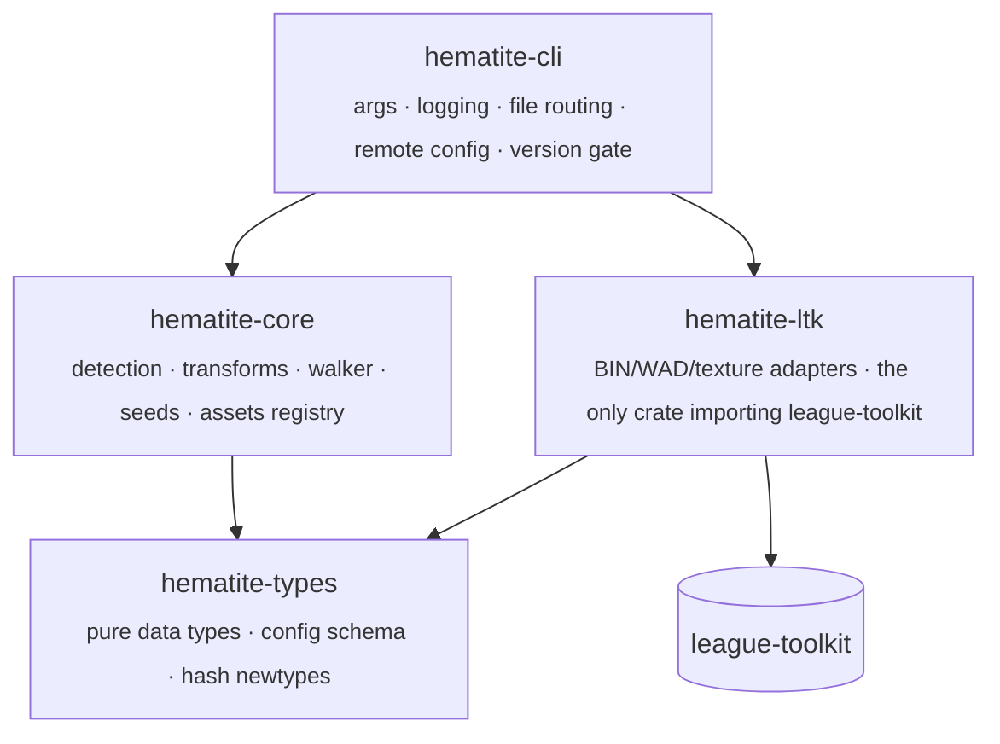
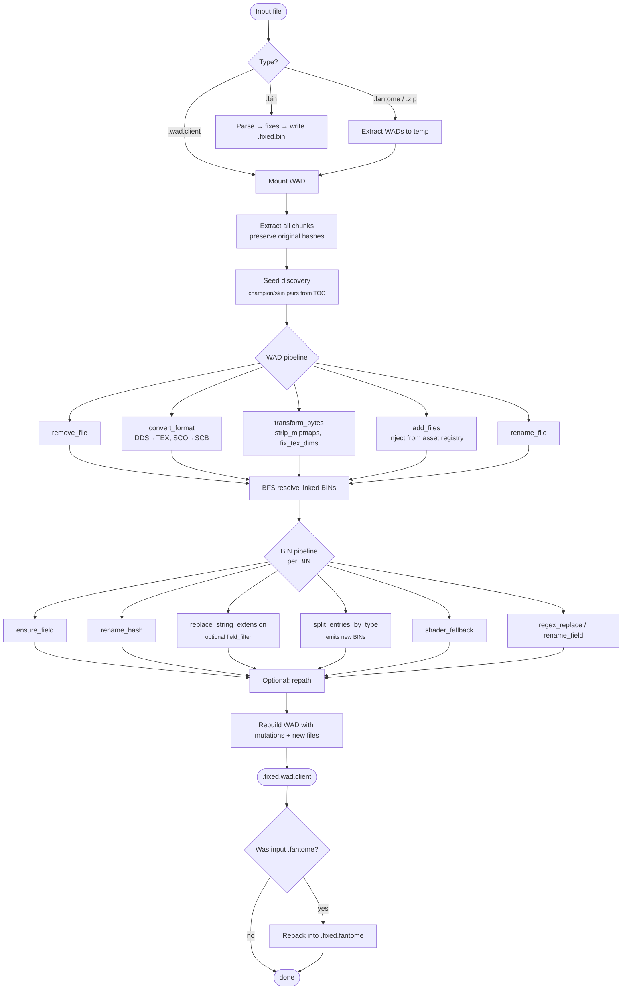

# Hematite — Developer Guide

Everything you need to hack on the engine — architecture, transform
framework, the dance for adding a new fix rule, build / test / release
workflow.

For the user-facing intro see [README.md](README.md).

---

## Table of contents

- [Architecture](#architecture)
- [Processing pipeline](#processing-pipeline)
- [Transform framework](#transform-framework)
  - [Anatomy of a fix rule](#anatomy-of-a-fix-rule)
  - [Detection rules](#detection-rules)
  - [Transform actions](#transform-actions)
  - [Producing new files](#producing-new-files)
  - [The named asset registry](#the-named-asset-registry)
  - [Seeds](#seeds)
- [Adding a new fix](#adding-a-new-fix)
  - […using only the config](#using-only-the-config)
  - […with a new transform action in Rust](#with-a-new-transform-action-in-rust)
  - […with a new in-place byte converter](#with-a-new-in-place-byte-converter)
- [Hash system](#hash-system)
- [Versioned force-update gate](#versioned-force-update-gate)
- [Build, test, lint](#build-test-lint)
- [Releasing](#releasing)
- [Conventional commits](#conventional-commits)

---

## Architecture

4-crate Rust workspace. The fix engine **never imports league-toolkit**
— when LTK changes its API, only the adapter crate needs updating.



Crate purpose:

| Crate | Responsibility |
|---|---|
| `hematite-types` | Pure data: `BinTree`, `FixConfig`, `RepathOptions`, hash newtypes. No deps on parsing libs. |
| `hematite-core` | Fix engine: detection rules, transform actions, BFS walker, fallback, repath, seed discovery, asset registry. Operates against trait abstractions. |
| `hematite-ltk` | The **only** crate that touches `league-toolkit`. Provides `BinProvider`, `HashProvider`, `WadProvider` implementations, plus texture converters (DDS↔TEX, strip-mipmaps, fix-dimensions). |
| `hematite-cli` | Binary: CLI args, logging, file-type routing, remote config fetching, the version-gate, batch orchestration. |

```
hematite-v2/
├── crates/
│   ├── hematite-types/   pure data types, config schema, hash newtypes
│   ├── hematite-core/    fix engine
│   ├── hematite-ltk/     LTK adapter + byte-level texture work
│   └── hematite-cli/     CLI binary
├── config/
│   ├── fix_config.json       fix rule definitions (remote-fetched, embedded fallback)
│   ├── champion_list.json    champion metadata + subchamp relationships
│   └── version.json          CLI version manifest (powers the force-update gate)
└── .github/workflows/
    ├── ci.yml                PR checks (fmt + clippy + test)
    └── release.yml           tag-triggered release (git-cliff + binary)
```

---

## Processing pipeline



---

## Transform framework

### Anatomy of a fix rule

Two flavours: **BIN-level** (`FixConfig.fixes`) and **WAD-level**
(`FixConfig.wad_fixes`). Each entry has the same shape:

```json
"fix_id": {
  "name": "Display name",
  "description": "What and why",
  "enabled": true,
  "severity": "low|medium|high|critical",
  "detect": { "type": "...", "...": "..." },
  "apply":  { "type": "...", "...": "..." }
}
```

The pipeline iterates `selected_fix_ids` from the CLI flags, looks each
ID up in `fixes` (BIN-level), falls back to `wad_fixes` (WAD-level),
silently skips IDs that match neither. Two-phase: WAD-level first
(operates on raw file bytes), BIN-level after (operates on parsed
trees).

### Detection rules

Schema: [`hematite-types::config::DetectionRule`](crates/hematite-types/src/config.rs) (BIN) and `WadDetectionRule` (WAD).

| Variant | Fires when |
|---|---|
| `missing_or_wrong_field` | A specific embed-path field is absent or has the wrong value |
| `field_hash_exists` | A dotted field path resolves to an existing property |
| `string_extension_not_in_wad` | A field's string ends in `<ext>` and the file isn't in the mod's WAD |
| `recursive_string_extension_not_in_wad` | Same, but walks the whole tree with optional path-prefix filter |
| `entry_type_exists_any` | At least one object's class hash matches one of the listed type names |
| `bnk_version_not_in` | BNK audio file ships a Wwise version not in the allowed list |
| `vfx_shape_needs_fix` | Object has the pre-14.1 VFX shape layout |
| `invalid_shader_reference` | Shader link points at a hash not in `hashes.shaders.txt` |
| `unreferenced_entry_of_type` | Entry types appear in the BIN but the main skin entry never references them |
| `file_extension` *(WAD)* | File path ends with the given extension (optional binary header check + exclude list) |
| `file_pattern` *(WAD)* | Glob-style path pattern + optional binary header check |
| `always` *(WAD)* | Whole-WAD rule — fires once per WAD, paired with `add_files` |

### Transform actions

Schema: [`hematite-types::config::TransformAction`](crates/hematite-types/src/config.rs) (BIN) and `WadTransformAction` (WAD).

| Variant | Effect |
|---|---|
| `ensure_field` | Add or overwrite a field, optionally creating parent embeds |
| `rename_hash` | Rename a field hash across the tree |
| `replace_string_extension` | `.from`→`.to` on every string, optional path-prefix and `field_filter` regex |
| `change_field_type` | Convert a field's value type (e.g. `link`→`string`, with `append_values` for vec3→vec4) |
| `regex_replace` / `regex_rename_field` | Regex over string values / field names |
| `vfx_shape_fix` | Migrate the post-14.1 VFX shape layout |
| `shader_fallback` | Replace invalid shader link with the closest valid hash |
| `remove_unreferenced_entries` | Drop CAD/AnimGraph/etc. entries unreferenced by the main entry |
| `split_entries_by_type` | **Move** objects of given class names into a brand-new BIN at a templated path (see below) |
| `remove_from_wad` | Mark the file for removal from the WAD |
| `remove_file` *(WAD)* | Drop the file from the rebuilt WAD |
| `convert_format` *(WAD)* | Pass bytes through a named converter (changes extension) |
| `transform_bytes` *(WAD)* | Pass bytes through a named converter (preserves extension — for in-place ops like mipmap-strip) |
| `rename_file` *(WAD)* | Regex-rename file paths with capture-group substitution |
| `add_files` *(WAD)* | Inject named assets from the asset registry at given paths |

### Producing new files

Three escape hatches from the "transforms only mutate" model:

1. **`add_files`** — for static blobs. Each entry references an asset
   *by name* (`invis_tex`, etc.). The asset registry resolves names →
   bytes at runtime, so the JSON stays portable and the binary
   doesn't have to embed every possible blob.
2. **`transform_bytes`** — for byte-level transforms that don't change
   the extension (mipmap stripping, dimension fixing). Same registry
   as `convert_format`, different action so the pipeline doesn't try
   to dedupe against an "already converted" target.
3. **`split_entries_by_type`** (BIN-level) — the source BIN keeps its
   reduced object set; the extracted objects land in a new `BinTree`
   that gets pushed to `FixContext.additional_bins`. The CLI
   serialises them via `BinProvider::write_bytes` and adds them as
   fresh chunks during WAD rebuild.

`split_entries_by_type` supports a small template DSL in
`output_path_template`:

| Token | Replaced with |
|---|---|
| `{source_dir}` | Directory of the source path (no trailing slash) |
| `{source_stem}` | Source filename, no extension |
| `{source_ext}` | Source extension, no leading dot |
| `{champion}` | Champion folder from `(data\|assets)/characters/{X}/...` (lowercased) |
| `{skin}` | First integer run in the source stem (e.g. `27` for `skin27.bin`) |

When `link_in_source` is true the new BIN's path is also appended to
`source.linked` so the engine resolves both files together.

### The named asset registry

[`hematite-core::assets`](crates/hematite-core/src/assets.rs) ships a
process-wide `name → &'static [u8]` map. Built-in: `invis_tex` (a 1×1
invisible TEX). Downstream binaries register more at startup:

```rust
// in your main()
hematite_core::assets::register("toonshading_tex", include_bytes!("blobs/toonshading.tex"));
```

Any `add_files` rule referencing the name will then succeed.

### Seeds

[`hematite-core::seeds`](crates/hematite-core/src/seeds.rs) scans a
WAD's resolved TOC for every `(data|assets)/characters/{X}/skins/skinN.bin`
and returns a deduped `Vec<SkinSeed>`. The CLI logs the result at the
start of WAD processing — surfaces subcharacters like `jinxmine`
alongside `jinx` so the user can confirm what's about to be processed.

```rust
let seeds = hematite_core::seeds::discover_seeds(
    all_files.iter().map(|(_, p, _)| p.as_str())
);
```

`order_with_primary(seeds, &primary)` puts a known seed first while
preserving the rest of the discovery order — useful when downstream
pipeline stages iterate over multiple skins.

---

## Adding a new fix

### …using only the config

If your fix is expressible as one of the existing detection /
transform variants, no Rust changes are needed.

1. Edit [`config/fix_config.json`](config/fix_config.json), add an
   entry under `fixes` (BIN-level) or `wad_fixes` (WAD-level) following
   [Anatomy of a fix rule](#anatomy-of-a-fix-rule).
2. Add the fix ID to `ALL_FIX_IDS` in
   [`crates/hematite-cli/src/args.rs`](crates/hematite-cli/src/args.rs)
   if you want it picked up by `--all`.
3. Add a CLI flag if you want a direct shortcut (clap field +
   matching `if cli.foo { fixes.push("my_fix".into()); }` line in
   `collect_selected_fixes`).
4. Run `cargo test --workspace`.

The remote config will pick up your rule on `main` push; CLIs find it
via the 1-hour TTL cache, falling back to the embedded config when
offline.

### …with a new transform action in Rust

1. Add a variant to [`TransformAction`](crates/hematite-types/src/config.rs)
   (or `WadTransformAction` for WAD-level).
2. Add a module under
   [`crates/hematite-core/src/transform/`](crates/hematite-core/src/transform/)
   exposing `pub fn apply(...) -> u32`.
3. Wire the dispatch arm in
   [`crates/hematite-core/src/transform/mod.rs`](crates/hematite-core/src/transform/mod.rs).
4. Write unit tests in the new module. Keep them table-driven where
   possible — the existing modules are a good reference.
5. Add an example rule to `fix_config.json` (disabled by default until
   validated against real mods).

If your transform needs to produce new BINs, push them to
`ctx.additional_bins` and the CLI will fold them into the rebuilt
WAD automatically (see [`split_entries`](crates/hematite-core/src/transform/split_entries.rs)
for a worked example).

### …with a new in-place byte converter

For raw-bytes work (texture munging, file-level repair):

1. Add a `pub fn my_thing(bytes: &[u8]) -> anyhow::Result<Vec<u8>>` to
   [`crates/hematite-ltk/src/`](crates/hematite-ltk/src/) — pick or
   create the appropriate module.
2. Register it in
   [`crates/hematite-cli/src/process.rs`](crates/hematite-cli/src/process.rs)
   right next to the other `converter_registry.register(...)` lines.
3. In `fix_config.json`, write a rule using
   `transform_bytes` (for same-extension transforms) or
   `convert_format` (for extension changes), referencing your
   converter by the registered name.

---

## Hash system

League uses hashed identifiers everywhere — Hematite resolves them at
startup.

| Hash kind | Width | Algorithm | Source |
|---|---|---|---|
| Type hash | u32 | FNV-1a | BIN class names |
| Field hash | u32 | FNV-1a | BIN field names |
| Path hash | u32 | FNV-1a | BIN entry paths |
| Game hash | u64 | xxhash64 | WAD asset paths |

**LMDB** (preferred): single database file at
`%APPDATA%\RitoShark\Requirements\Hashes\hashes.lmdb`. Loads 1.8M
hashes in ~800ms via [`heed`](https://crates.io/crates/heed).
Auto-downloaded from GitHub releases on first run.

**TXT fallback**: individual text files in the same directory
(`hashes.bintypes.txt`, `hashes.binfields.txt`, `hashes.binentries.txt`,
`hashes.game.txt`, `hashes.shaders.txt`). Slower but works without
the LMDB.

LMDB `map_size` must be page-aligned (`div_ceil(page) * page`) — see
[`crates/hematite-ltk/src/lmdb_hash_adapter.rs`](crates/hematite-ltk/src/lmdb_hash_adapter.rs).

---

## Versioned force-update gate

Hematite is normally config-driven — fix rules, champion data, repath
defaults all live in JSON files that get fetched at runtime. So the
binary rarely needs to be re-shipped. When something *does* force a
binary change (BIN parser breakage, hash schema bump, etc.), we
refuse to run outdated CLIs without users having to discover that on
their own.

**How it works** — [`crates/hematite-cli/src/version_check.rs`](crates/hematite-cli/src/version_check.rs):

1. On startup, fetch [`config/version.json`](config/version.json) (15-min
   cache, embedded permissive fallback).
2. Compare `env!("CARGO_PKG_VERSION")` against `min_cli_version` and
   `latest_cli_version` via `semver`.
3. Three outcomes:
   - `running >= latest_cli_version` → silent.
   - `running >= min_cli_version, < latest_cli_version` → soft banner,
     proceed.
   - `running < min_cli_version` → hard block (unless
     `--skip-version-check` was passed).

**To force every old CLI in the wild to upgrade**, edit
`config/version.json`:

```json
{
  "latest_cli_version": "0.4.1",
  "min_cli_version":    "0.4.0",
  "download_url": "https://github.com/RitoShark/Hematite/releases/latest",
  "release_notes": "Fixes BIN parser regression on patch 14.20 mods."
}
```

Push to `main`, every old CLI run starts refusing to run within the
TTL window. No recompile.

**Advisories** — `advisories: [...]` lets you push out-of-band
warnings (yellow / red / blue banners) that surface regardless of
the gate state. Useful for "patch X breaks Y, please upgrade" notes.

---

## Build, test, lint

```bash
# Build (debug)
cargo build --workspace

# Build (release, just the CLI binary)
cargo build --release --bin hematite-cli
# → target/release/hematite-cli.exe

# Run the test suite (currently 152 unit tests + doc-tests)
cargo test --workspace

# Clippy with workspace lint policy
cargo clippy --workspace -- -D warnings -A clippy::needless_return

# Format check
cargo fmt --all -- --check
```

**Requirements**: Rust 1.75+ (2021 edition). Windows is the primary
target; Linux/macOS compile but the binary is mostly useful on
Windows since the game is.

---

## Releasing

Releases are automated via [`.github/workflows/release.yml`](.github/workflows/release.yml).

```bash
# 1. Bump version in Cargo.toml (workspace `version`).
# 2. Optionally bump latest_cli_version (and min_cli_version) in
#    config/version.json — see the gate section above.
# 3. Commit + tag.
git commit -am "chore: release v0.4.0"
git tag v0.4.0
git push && git push origin v0.4.0

# CI does the rest:
#   - git-cliff generates changelog from conventional commits
#   - cargo build --release
#   - GitHub Release with changelog + binary
```

---

## Conventional commits

[`cliff.toml`](cliff.toml) groups commits into changelog sections by
prefix:

| Prefix | Section |
|---|---|
| `feat:` | Features |
| `fix:` | Bug Fixes |
| `perf:` | Performance |
| `refactor:` | Refactor |
| `doc:` | Documentation |
| `revert:` | Reverts |
| `chore:`, `ci:`, `build:` | **Skipped** (not in changelog) |

Scope is optional but encouraged: `feat(repath): add modder-root paths`.
Commits that don't follow the format are filtered out of the
changelog (`filter_unconventional = true`).

**Rules**:
- Never add `Co-Authored-By:` lines.
- Keep subjects short and imperative (`fix wad cache loading`, not
  `Fixed the WAD cache loading bug because it was broken`).
- Prefer one logical change per commit so `git bisect` stays useful.

---

<p align="center"><sub>
  Back to <a href="README.md">README</a> · file an issue at <a href="https://github.com/RitoShark/Hematite/issues">Hematite/issues</a>
</sub></p>
